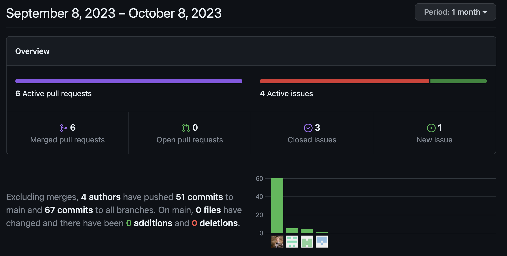
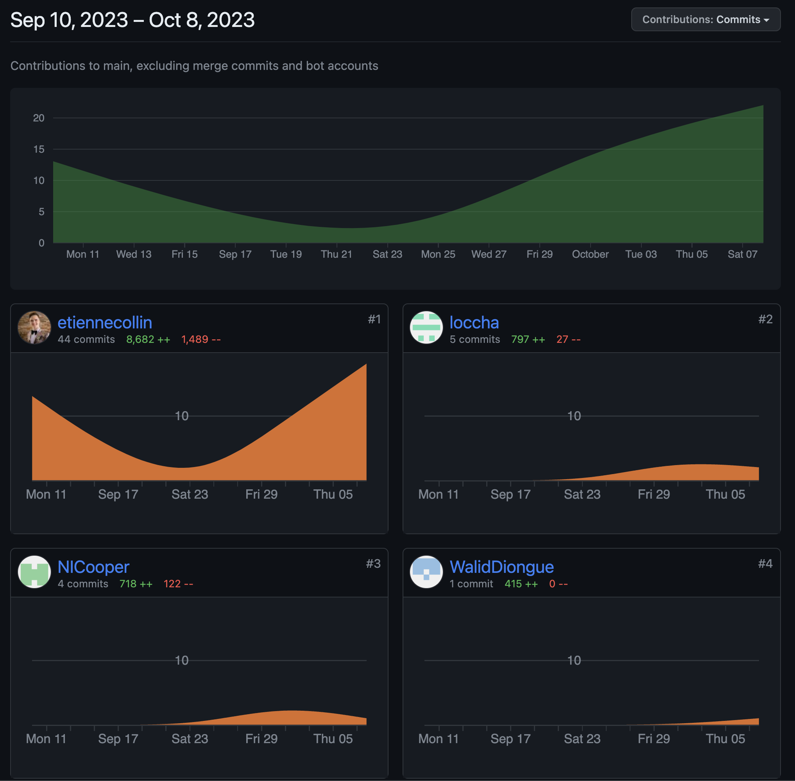

# IFT 2255 - Automne 2023 - Devoir 1 <!-- omit from toc -->

---

## Table des contenus

- [Table des contenus](#table-des-contenus)
- [Information générale](#information-générale)
- [Distribution des tâches](#distribution-des-tâches)
    - [Tâche 1](#tâche-1)
        - [Glossaire](#glossaire)
    - [Tâche 2](#tâche-2)
    - [Tâche 3](#tâche-3)
        - [Cas d’utilisation](#cas-dutilisation)
    - [Tâche 4](#tâche-4)
        - [Risques](#risques)
    - [Tâche 5](#tâche-5)
        - [Exigences non-fonctionnelles](#exigences-non-fonctionnelles)
    - [Tâche bonus](#tâche-bonus)
    - [GitHub Insights](#github-insights)
        - [Pulse:](#pulse)
        - [Contributors](#contributors)

## Information générale

**Nom de l'équipe:** Null Pointer Exception

[Lien vers le repository sur GitHub](https://github.com/etiennecollin/ift2255/)

[Lien vers la release sur GitHub](https://github.com/etiennecollin/ift2255/releases/tag/v0.1.0)

| Nom                     | Matricule | Courriel                             | Temps |
| :---------------------- | :-------: | :----------------------------------- | :---: |
| Etienne Collin          | 20237904  | etienne.collin@umontreal.ca          |  10+  |
| Charlotte Locas         | 20211755  | nicholas.cooper@umontreal.ca         |  10+  |
| Nicholas Cooper         | 20241729  | charlotte.locas@umontreal.ca         |  10+  |
| Aboubakre Walid Diongue | 20198446  | aboubakre.walid.diongue@umontreal.ca |  10+  |

## Distribution des tâches

**Soumissionaire**: Etienne Collin

|                     Tâches | Etienne | Charlotte | Nicholas | Walid |
| -------------------------: | :------ | :-------- | :------- | :---- |
|                  Prototype | 33      | 47        | 30       | 0     |
|    Diagramme d'utilisation | 10      | 20        | 10       | 60    |
|                    rapport | 15      | 0         | 0        | 85    |
|                  glossaire | 22      | 28        | 22       | 28    |
|                     risque | 100     | 0         | 0        | 0     |
| exigence non-fonctionnelle | 80      | 0         | 20       | 0     |
|         cas d'utilisations | 30      | 42        | 14       | 14    |

### Tâche 1

Voici la solution pour le **glossaire.**

#### Glossaire

-   Adresse d’expédition
    -   Adresse physique de l’acheteur à laquelle la commande de l’acheteur sera envoyée. Contient: numéro, rue, unité (optionnelle), ville, province, pays, code postale.
-   Panier d’achat
    -   Une liste modifiable de produits avec quantités que l’acheteur à l’intention de commander. L’utilisateur n’est pas obligé d’acheter ces produits.
-   Acheteur
    -   Étudiant qui achète des produits depuis la plateforme.
-   Vendeur/Revendeur
    -   Étudiant, particulier ou entreprise disposant d’au moins d’un produit à vendre sur la plateforme
-   Profil
    -   Informations fournies par l’utilisateur tel que: nom (unique), adresse, adresse courriel, téléphone.
-   Recommandation de produits
    -   Suggestions de produits basées sur les préférences et les activités passées des acheteurs, visant à améliorer leur expérience et les guider dans leurs futurs achats.
-   Catalogue de produits

    -   Les produits disponibles sur Unishop sont organisés en différentes catégories correspondant aux besoins des étudiants.

-   Passer une commande
    -   Processus englobant toute action menant à l’achat d’un produit, allant de la fourniture des informations de paiement et des informations du profil à l’adresse de livraison.
-   Évaluation de produits
    -   Avis laissé par un acheteur sur un produit acheté.
-   Retour ou échange de commande
    -   Retour ou échange d’un produit dans les 30 jours suivant l’achat par l’acheteur.
-   Inventaire
    -   Liste mise à jour des produits disponibles d’un revendeur pour la vente sur Unishop.

### Tâche 2

Voici la solution pour la **diagramme de cas d'utilisation UML**.

> Source disponible sur la [release GitHub](https://github.com/etiennecollin/ift2255/releases/tag/v0.1.0)

### Tâche 3

Voici la solution pour les **cas d'utilisation**.

#### Cas d’utilisation

-   Consulter le catalogue de produits
    -   But:
        -   Permettre aux acheteurs et vendeurs de parcourir les produits offerts
    -   Préconditions:
        -   Des produits existent dans le système
        -   L’utilisateur doit avoir un compte valide sur la plateforme Unishop
    -   Acteurs:
        -   Acheteurs
        -   Revendeurs
    -   Scénario principal:
        -   1.L’utilisateur sélectionne le catalogue
        -   2.Le système fait une requête et va chercher la liste des produits
        -   3.L’utilisateur choisit le tri pour le catalogue:
            -   Défaut: Alphabétique ascendant
            -   Alphabétique descendant
            -   Prix descendant
            -   Prix ascendant
            -   Nombre de likes
            -   Nombre de commentaires
        -   4.Le système met à jour le tri de la liste des produits
        -   5.L’utilisateur choisit le filtre pour le catalogue:
            -   Défaut: Aucun
            -   Livres et manuels
            -   Ressources d'apprentissage
            -   Articles de papeterie
            -   Matériel informatique
            -   Équipement de bureau
        -   6.Le système met à jour le filtre de la liste des produits
    -   Scénarios alternatifs: NA
    -   Postconditions: NA
-   Liker un commentaire sur un produit
    -   But:
        -   Classifier les commentaires par ordre de popularité afin de permettre aux acheteurs de trouver les meilleurs commentaires plus facilement
    -   Préconditions:
        -   Posséder un compte d’acheteur valide
        -   Des commentaires existent pour le produit sélectionné
    -   Acteurs:
        -   Les acheteurs sont les acteurs principaux.
    -   Scénario principal:
        -   1.L’acheteur se connecte à son compte d’acheteur
        -   2.L’acheteur consulte le catalogue
        -   3.L’acheteur sélectionne un produit
        -   4.L’acheteur sélectionne un commentaire sur le produit
        -   5.L’acheteur clique sur le bouton “like”
        -   6.Le système met à jour le nombre de likes sur le commentaire
            -   7.1Le système vérifie si le commentaire avait déjà été liké par l’acheteur
                -   Si oui, le like n’est pas considéré par le système
                -   Si non, le like est ajouté
    -   Scénario alternatif: NA
    -   Postconditions: Le like du client sera considéré dans le nombre de likes du commentaire affiché
-   Liker un produit

    -   But:
        -   Permettre de classifier la popularité des produits afin de permettre aux acheteurs de trouver les produits favoris plus facilement
    -   Préconditions:
        -   Posséder un compte d’acheteur valide
        -   Il existe au moins un produit en vente.
    -   Acteurs:
        -   Les acheteurs
    -   Scénario principal:
        -   1.L’acheteur se connecte à son compte d’acheteur
        -   2.L’acheteur consulte le catalogue
        -   3.L’acheteur sélectionne un produit
        -   4.L’acheteur clique sur le bouton “like”
        -   5.Le système met à jour le nombre de likes sur le produit
            -   5.1Le système vérifie si le produit avait déjà été liké par l’acheteur
                -   Si oui, le like n’est pas considéré par le système.
                -   Si non, le like est ajouté
    -   Scénario alternatif: NA
    -   Postconditions: Le like du client sera considéré dans le nombre de likes du produit affiché

-   Recherche de produit:
    -   But:
        -   Permettre à l’utilisateur de trouver le produit souhaité
    -   Préconditions:
        -   L’utilisateur doit avoir un compte valide sur la plateforme Unishop
    -   Acteurs:
        -   Les acheteurs et vendeurs sont les acteurs principaux
    -   Scénario principal
        -   1.L’utilisateur ouvre la plateforme Unishop
        -   2.L’utilisateur se connecte à son compte
        -   3.L’utilisateur sélectionne l’option de recherche
        -   4.L’utilisateur tape une information sur le produit
        -   5.L’utilisateur envoie sa recherche
        -   6.Le système reçoit la requête et la traite
            -   6.1Le système “fuzzy search” l’entièreté du catalogue en utilisant les informations disponibles sur les produits (numéro de produit, nom de produit, description, tags?, commentaires)
            -   6.2Le système prend la liste de produits trouvés et la retourne à l’utilisateur avec la même interface que le catalogue (voir cas d’utilisation du catalogue).
        -   7.L’utilisateur parcourt le catalogue affiché
    -   Scénarios alternatifs
        -   6.1a Si aucun produit n’est trouvé, le système affiche un message d’erreur mentionnant d’essayer de rechercher avec d’autres termes.
    -   Postconditions: NA
-   Évaluation des produits

    -   But:
        -   Permettre à l’acheteur de noter et d’évaluer le produit qu’il a acheté
    -   Préconditions:
        -   L’acheteur doit avoir un compte acheteur valide sur la plateforme Unishop
        -   L’acheteur doit avoir fait l’achat du produit à évaluer
    -   Acteurs:
        -   Les acheteurs sont les acteurs principaux
    -   Scénario principal

        -   1.L’acheteur ouvre la plateforme Unishop
        -   2.L’acheteur se connecte à son compte d’acheteur
        -   3.L’acheteur clique sur l’onglet “Mes commandes”
        -   4.L’acheteur sélectionne la commande qu’il veut évaluer
        -   5.L’acheteur clique sur la mention “Évaluer le produit”
        -   6.L’acheteur évalue le produit
            -   6.1 - L’acheteur entre une note sur 5 dans la section indiquée
            -   6.2 - L’acheteur écrit un commentaire sur le produit dans la section indiquée
        -   7.L’acheteur clique sur le bouton “Évaluer”
        -   8.Le système valide la note et le commentaire
        -   9.Le système enregistre l’évaluation et l’affiche dans la section approprié sous le produit évalué

    -   Scénarios alternatifs
        -   6.1a Si l’acheteur n’entre pas de note, le système affiche un message d’erreur lui demandant d’entrer une note sur 5
        -   6.2a Si l’acheteur n’entre pas de commentaire, le système affiche un message d’erreur lui demandant d’écrire un commentaire
    -   Postconditions: L’évaluation du client sera affiché dans la section commentaire sous l’article évalué

-   Passer une commande

    -   But:
        -   Permettre à un acheteur de procéder à l’achat des produits.
    -   Préconditions:
        -   L’acheteur à des produits dans son panier.
    -   Acteurs:
        -   L’acheteur est l’acteur principal.
    -   Scénario principal:
        -   1.L’acheteur accède à son panier et sélectionne les produits à acheter.
        -   2.L’acheteur confirme les produits dans son panier.
        -   3.L’acheteur fournit les informations de paiement et de livraison.
        -   4.L’acheteur confirme la commande
        -   5.L’inventaire du revendeur est mis-à-jour et un identifiant unique est généré pour la commande.
    -   Scénario alternatifs :

        -   1a. L'acheteur décide de modifier la quantité d'un produit dans son panier.

            -   1.L'acheteur accède à son panier.
            -   2.L'acheteur modifie la quantité du produit sélectionné.
            -   3.Le système met à jour le montant total à payer en fonction de la nouvelle quantité.

        -   1b. L'acheteur décide d'annuler la commande.

            -   1.L'acheteur accède à son panier.
            -   2.L'acheteur sélectionne l'option "Annuler la commande".
            -   3.Le système annule la commande et remet les produits dans l'inventaire du revendeur.

        -   1c. L'acheteur souhaite utiliser une adresse de livraison différente de celle enregistrée dans son profil.

            -   1.L'acheteur accède à son panier.
            -   2.L'acheteur sélectionne l'option "Utiliser une autre adresse de livraison".
            -   3.L'acheteur fournit les nouvelles informations de livraison.
            -   4.Le système utilise les nouvelles informations pour la livraison et met à jour la commande.

        -   3a. Le système détecte un problème avec les informations de paiement.

            -   1.Le système vérifie les informations de paiement fournies par l'acheteur.
            -   2.Le système informe l'acheteur qu'il y a un problème avec les informations de paiement.
            -   3.L'acheteur fournit des informations de paiement correctes.
            -   4.Le système reprend le processus de commande.

        -   4a.L'acheteur ne peut pas confirmer la commande en raison d'un problème technique.
            -   1.Le système rencontre un problème technique lors de la confirmation de la commande.
            -   2.Le système informe l'acheteur du problème et lui demande de réessayer plus tard.
            -   3.L'acheteur réessaie de confirmer la commande ultérieurement.

    -   Postconditions: L’acheteur reçoit un identifiant unique lui permettant de suivre sa commande.

-   Signaler un problème avec un produit

    -   But: Signaler un problème avec un produit au revendeur
    -   Préconditions:
        -   Posséder un compte d’acheteur valide
        -   L’acheteur doit avoir fait une commande avec UniShop il y a moins de 30 jours
    -   Acteurs:
        -   Les acheteurs et les revendeurs sont les acteurs principaux
    -   Scénario principal
        -   1.L’acheteur se connecte à son compte d’acheteur sur la plateforme
        -   2.L’acheteur clique sur l’onglet “Mes commandes”
        -   3.L’acheteur sélectionne le produit qu’il veut signaler
        -   4.L’acheteur clique sur l’option “Signaler un problème”
        -   5.L’acheteur sélectionne la raison du signalement dans la barre de défilement (ex: commande non reçue)
        -   6.L’acheteur décrit plus spécifiquement la raison de son retour dans la section indiquée
        -   7.L’acheteur clique sur le bouton “Envoyer”
    -   Scénario alternatif

        -   4a Le client sélectionne un produit acheté il y a plus de 30 jours
        -   4a.1 Le système envoie un message indiquant qu’il est impossible de signaler un produit acheté il y a plus de 30 jours. Le système ne permet pas le signalement
        -   5a Si l’acheteur ne sélectionne aucune raison dans la barre de défilement, le système envoie un message demandant au client de choisir la raison du signalement.
        -   5a.1 L’acheteur sélectionne une raison pour compléter le signalement
        -   6a.L’acheteur peut choisir de ne pas écrire de message au revendeur

    -   Postconditions: Un message est transmis dans la boîte de réception du revendeur contenant les détails du signalement et l’invitant à prendre action.

-   S’inscrire comme acheteur

    -   But:
        -   Créer un nouveau compte d’acheteur
    -   Préconditions:
        -   Accès à la plateforme Unishop
    -   Acteurs:
        -   Les futurs acheteurs sont les acteurs principaux.
    -   Scénario principal
        -   1.L’acheteur ouvre la plateforme Unishop
        -   2.Le client sélectionne l’option Créer un compte d’acheteur
        -   3.L’acheteur navigue à la page d’inscription
        -   4.L’acheteur sélectionne l’option de créer un compte d’acheteur
        -   5.L’acheteur saisit ses informations
            -   5.1 L’acheteur entre son nom dans la section indiquée
            -   5.2 L’acheteur entre son prénom dans la section indiquée
            -   5.3L’acheteur entre un nom d’utilisateur unique dans la section indiquée
            -   5.4L’acheteur entre son adresse courriel dans la section indiquée
            -   5.5L’acheteur entre son numéro de téléphone dans la section indiquée
            -   5.6L’acheteur entre son adresse d’expédition dans la section indiquée
            -   5.7L’acheteur clique sur le bouton “s’inscrire”
        -   6.Le système valide les données et crée le compte
        -   7.Le système envoie l’acheteur au tableau de bord
    -   Scénarios alternatifs
        -   5.3a Si l’acheteur entre un nom d’utilisateur déjà utilisé par un autre membre, le système l’informe que ce nom d’utilisateur est déjà utilisé et d’en inscrire un autre
        -   5.4a Si l’adresse courriel est déjà utilisé, le système lui indique qu’il y a déjà un compte créé à cette adresse courriel
        -   5.4a.1 Le client entre un nouveau nom d’utilisateur pour compléter son inscription
        -   5.4b Si l’adresse courriel ne correspond pas au format accepté, le système lui demande d’entrer une adresse courriel valide.
        -   5.4b.1 Le client corrige l’erreur pour compléter son inscription
        -   5.5a Si le numéro de téléphone ne correspond pas au format accepté, le système lui demande d’entrer un numéro de téléphone valide.
        -   5.5a.1 Le client corrige l’erreur pour compléter son inscription
        -   5.6a Si l’adresse d’expédition n’existe pas, le système lui demande d’entrer une adresse d’expédition valide.
        -   5.6a.1 Le client corrige l’erreur pour compléter son inscription
        -   Postconditions: Le compte d’acheteur sera enregistré dans le système

-   Confirmer la réception d’une commande

    -   But: Permettre à un acheteur de marquer qu’une commande a été livrée.
    -   Préconditions:
        -   L’acheteur a un compte d’acheteur sur la plateforme.
        -   L’acheteur a fait une commande.
    -   Acteurs: L’acheteur est l’acteur principal.
    -   Scénario principal:
        -   1.L’acheteur se connecte à son compte UniShop.
        -   2.L’acheteur sélectionne l’option “Mes commandes”.
        -   3.L’acheteur sélectionne une commande qui est à l’état “en livraison”.
        -   4.L’acheteur sélectionne l’option d’état de commande “livré”.
            Scénario alternatif:
        -   3a. L’acheteur n’a pas passé une commande.
            3a.1 Le système dit à l’acheteur qu’il n’y a pas de commande à afficher.
        -   4a. L’acheteur a sélectionné une commande dont l’état n’est pas “en livraison”.
            4a.1 L’option de marquer que la commande “livré” n’est pas affichée.
    -   Postconditions: La commande est marquée “livré” pour l’acheteur et le revendeur.

-   S’inscrire comme revendeur

    -   But:
        -   Créer un nouveau compte de revendeur
    -   Préconditions:
        -   Avoir accès à UniShop et posséder au moins 1 article à vendre.
    -   Acteurs:
        -   Le revendeur est l'acteur principal.
    -   Scénario principal

        -   1.Le revendeur accède au site web
        -   2.Le revendeur navigue à la page d’inscription
        -   3.Le revendeur sélectionne l’option de créer un compte de revendeur
        -   4.Le revendeur saisit ses informations

            -   4.1 Le revendeur saisit le nom de son entreprise
            -   4.2 Le revendeur saisit l’adresse de son entreprise
            -   4.3 Le revendeur saisit l’adresse courriel de son entreprise
            -   4.4 Le revendeur saisit le numéro de téléphone de son entreprise

        -   5.Le système valide les données et crée le compte
        -   6.Le système envoie le revendeur au dashboard de revendeur

    -   Scénarios alternatifs

        -   5.a. Le nom de l’entreprise existe déjà dans le système - 5.a.1. Le système affiche un message au revendeur qu’il faut choisir un autre nom - 5.a.2 Le système renvoie le revendeur à l’étape 4
        -   5.b Le système refuse le format de l’adresse, adresse courriel, ou numéro de téléphone
            -   5.b.1 Le système affiche un message qui explique lequel n’été pas valide
            -   5.b.2 Le système renvoie le revendeur à l’étape 4

    -   Postconditions - Un nouveau compte de revendeur existe dans le système

-   Modifier les information d’un compte

    -   But:
        -   Modifier une ou plusieurs information d’un compte (acheteur ou revendeur)
    -   Préconditions:
        -   Détenir un compte d’acheteur ou de revendeur valide de la plateforme Unishop
    -   Acteurs:
        -   L’acheteur ou le revendeur est l’acteur principal. Il n’y a pas d’acteur secondaire.
    -   Scénario principal

        -   1.Le client accède à la plateforme Unishop
        -   2.Le client se connecte à son compte
        -   3.Le client accède à la section “Modifier les informations de mon compte”
        -   4.Le client corrige les éléments dans les boîtes appropriées

            -   4.1 Le client peut modifier son adresse courriel
            -   4.2 Le client peut modifier son numéro de téléphone
            -   4.3.1 L’acheteur peut modifier son adresse de livraison
            -   4.3.2 Le revendeur peut modifier son adresse

        -   5.Le client clique sur “enregistrer”
        -   6.Le système valide les données
        -   7.Le système remplace les anciennes données par les nouvelles données

    -   Scénarios alternatifs

        -   4.1a Si la nouvelle adresse courriel ne correspond pas au format accepté, le système lui demande d’entrer une adresse courriel valide.
        -   4.1a.1 Le client corrige l’erreur pour valider la nouvelle adresse courriel
        -   4.1b Si la nouvelle adresse courriel est déjà associé à un compte, le système l’informe et lui demande d’entrer une adresse courriel qui n’est pas associé à un compte
        -   4.1b.1 Le client entre une adresse courriel qui n’est pas associé à un compte
        -   4.2a Si le nouveau numéro de téléphone ne correspond pas au format accepté, le système lui demande d’entrer un numéro de téléphone valide.
        -   4.2a.1 Le client corrige l’erreur pour valider son nouveau numéro de téléphone
        -   4.3a Si l’adresse n’existe pas, le système lui demande d’entrer une adresse d’expédition valide.
        -   4.3a.1 Le client corrige l’erreur pour valider sa nouvelle adresse

    -   Postconditions:
        -   Le compte du client est mis à jours dans le système

-   Offrir un produit en tant que revendeur

    -   But
        -   Permettre à un revendeur de proposer un nouveau produit sur UniShop.
    -   Préconditions:
        -   Le revendeur dispose au moins d’un produit et est connecté sur UniShop.
    -   Acteurs:
        -   Le revendeur est l’acteur principal.
    -   Scénario principal

        -   1.Le revendeur accède à la fonction d’offre de produit sur UniShop.
        -   2.Le revendeur remplit le formulaire d’offre de produit en spécifiant le titre, la catégorie, la description, la marque, le modèle, la quantité initiale et le prix.
        -   3.Le revendeur met des images et vidéos du produit.
        -   4.Le revendeur soumet l’offre du produit.

    -   Scénarios alternatifs :

        -   1.Le revendeur souhaite modifier les détails du produit.

            -   1.Le revendeur accède à la liste de ses produits.
            -   2.Le revendeur sélectionne le produit à modifier.
            -   3.Le revendeur modifie les informations du produit.
            -   4.Le revendeur soumet les nouvelles informations du produit.

        -   2.Le système détecte une erreur dans les informations du produit.

            -   Le système vérifie les informations fournies par le revendeur.
            -   Le système détecte une erreur dans les détails du produit.
            -   Le système informe le revendeur de l'erreur.
            -   Le revendeur corrige les informations du produit.
            -   Le revendeur soumet à nouveau les informations du produit.

    -   Postconditions: Le produit est ajouté à la liste des produits disponibles.

-   Changer l’état d’une commande

    -   But: Permettre au revendeur de tenir l’acheteur informé de l’état de sa commande - Préconditions: - Le revendeur doit avoir un compte de revendeur valide - Le revendeur doit avoir vendu au moins un article à un acheteur
    -   Acteurs: Le revendeur est un acteur principal et l’acheteur est l’acteur secondaire
    -   Scénario principal

        -   1.Le revendeur se connecte à son compte de revendeur sur UniShop
        -   2.Le revendeur sélectionne l’onglet “Changer l’état d’une commande”
        -   3.Le revendeur sélectionne la commande à mettre à jours
        -   4.Le revendeur sélectionne le menu déroulant et choisit l’option appropriée
        -   5.Le revendeur clique sur “Enregistrer”

    -   Scénarios alternatifs

        -   4.a Si le revendeur choisit l’option «en livraison», le revendeur doit transmettre à l’acheteur le nom de la compagnie d’expédition et le numéro de suivi dans la section indiquée
        -   4.a.1 Si le revendeur laisse cette section vide, le système lui indique d’inscrire le nom de la compagnie et/ou le numéro de suivis pour poursuivre le changement d’état

    -   Postconditions: Le changement est mis à jours dans le système et est visible pour l’acheteur.

-   Gestion de problèmes

    -   But:
        -   Permettre à un revendeur de gérer les problèmes concernant leurs produits.
    -   Préconditions:
        -   Être un revendeur sur UniShop et avoir des problèmes signalés par les acheteurs.
    -   Acteurs:
        -   Le revendeur est un acteur (principal).
    -   Scénario principal:
        -   1.Le revendeur accède à la liste des problèmes signalés.
        -   2.Le revendeur sélectionne un problème à résoudre.
        -   3.Le revendeur propose une solution pour résoudre le problème.
        -   4.L’acheteur accepte la solution proposée par le revendeur.
        -   5.Le revendeur met en ouvre la solution acceptée.
    -   Scénarios alternatifs:

        -   3a.Le revendeur propose une solution, mais l'acheteur n'est pas d'accord.

            -   1.L'acheteur n'est pas satisfait de la solution proposée par le revendeur.
            -   2.L'acheteur refuse la solution.
            -   3.Le revendeur propose une alternative ou une nouvelle solution.
            -   4.L'acheteur accepte la nouvelle solution proposée.

        -   3b. Le revendeur ne parvient pas à proposer une solution satisfaisante.

            -   1.Le revendeur a du mal à proposer une solution adéquate.
            -   2.Le revendeur demande l'intervention d'un responsable ou d'un service dédié.
            -   3.Un responsable ou un service spécialisé propose une solution.
            -   4.L'acheteur accepte la solution proposée par le responsable ou le service spécialisé.

        -   4. L'acheteur change d'avis concernant la solution acceptée.

            -   1.L'acheteur accepte une solution, puis change d'avis.
            -   2.L'acheteur communique avec le revendeur pour expliquer son changement d'avis.
            -   3.Le revendeur propose une alternative qui satisfait l'acheteur.

    -   Postconditions: Le problème signalé est résolu et clos.

### Tâche 4

Voici la solution pour les **risques**.

#### Risques

-   La plateforme n’a pas une bonne adhésion:
    -   Manque de produits
    -   Meilleurs prix ailleurs
    -   Le système n’est pas assez convivial pour les acheteurs
        -   Le catalogue est difficile à naviguer
        -   Le catalogue n’a pas assez de filtres
    -   Les produits manquent d’information
    -   Le système n’est pas assez convivial pour les vendeurs
    -   Il est difficile de trouver les meilleurs produits
        -   Il manque d’indications quant aux likes dans le catalogue
-   Le système est lent:
    -   La recherche de produits est lente
        -   Mauvais algo de fuzzy finding
    -   Le catalogue prend trop de temps à charger
-   Le système a des fausses reviews
    -   Les vendeurs peuvent liker des produits
    -   Les vendeurs peuvent liker des commentaires
    -   Les vendeurs peuvent écrire des commentaires

### Tâche 5

Voici la solution pour les **exigences non-fonctionnelles.**

#### Exigences non-fonctionnelles

-   Exigence
    -   Description
-   Protection de données personnelles
    -   Stockage chiffré de mots de passe
-   Transactions simples et sécurisées
-   Proposer un service après vente en ligne efficace qui deal avec les vendeurs directement
-   Prix de shipping pas trop élevé
-   Shipping rapide et avec un tracking
-   Différentes méthodes de paiements (paypal, crédit, carte-cadeau…)

### Tâche bonus

Voici la solution pour la **tâche bonus.**

-   Voir la [release sur GitHub](https://github.com/etiennecollin/ift2255/releases/tag/v0.1.0)

### GitHub Insights

#### Pulse:

#### Contributors

