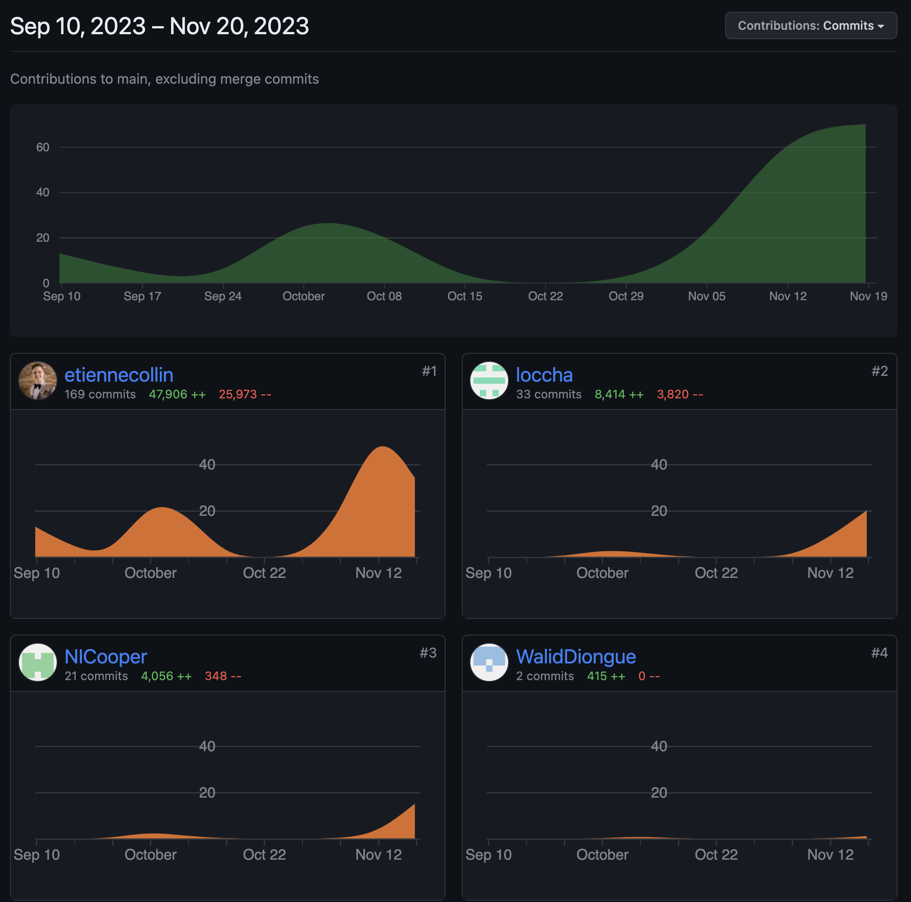

# IFT 2255 - Automne 2023 - Devoir 2 <!-- omit from toc -->

---

## Table des matières

- [Table des matières](#table-des-matières)
- [Information générale](#information-générale)
- [Distribution des tâches](#distribution-des-tâches)
- [Hypothèses](#hypothèses)
- [Tâche 1 - Analyse](#tâche-1---analyse)
- [Tâche 2 - Diagrammes d'activités UML](#tâche-2---diagrammes-dactivités-uml)
    - [Confirmer une commande](#confirmer-une-commande)
    - [Créer une commande](#créer-une-commande)
    - [Menus principaux](#menus-principaux)
    - [Offrir un produit](#offrir-un-produit)
    - [Retourner ou échanger une commande](#retourner-ou-échanger-une-commande)
    - [Évaluer un produit](#évaluer-un-produit)
- [Tâche 3 - Diagramme de classes UML](#tâche-3---diagramme-de-classes-uml)
- [Tâche 4 - Diagrammes de séquence UML](#tâche-4---diagrammes-de-séquence-uml)
    - [Créer une commande](#créer-une-commande-1)
    - [Offrir un produit](#offrir-un-produit-1)
    - [Confirmer la réception d'une commande](#confirmer-la-réception-dune-commande)
    - [Retourner ou échanger une commande](#retourner-ou-échanger-une-commande-1)
    - [Évaluer un produit](#évaluer-un-produit-1)
- [GitHub Insights](#github-insights)
    - [Pulse:](#pulse)
    - [Contributors](#contributors)

## Information générale

**Nom de l'équipe:** Null Pointer Exception

[Lien vers le repository sur GitHub](https://github.com/etiennecollin/ift2255/)

[Lien vers la release sur GitHub](https://github.com/etiennecollin/ift2255/releases/tag/v0.1.0)

| Nom                     | Matricule | Courriel                             | Temps |
| :---------------------- | :-------: | :----------------------------------- | :---: |
| Etienne Collin          | 20237904  | etienne.collin@umontreal.ca          |  30+  |
| Charlotte Locas         | 20211755  | nicholas.cooper@umontreal.ca         |  25+  |
| Nicholas Cooper         | 20241729  | charlotte.locas@umontreal.ca         |  30+  |
| Aboubakre Walid Diongue | 20198446  | aboubakre.walid.diongue@umontreal.ca |  10+  |

## Distribution des tâches

**Soumissionaire**: Etienne Collin

|                                              Tâches | Etienne | Charlotte | Nicholas | Walid |
| --------------------------------------------------: | :------ | :-------- | :------- | :---- |
|                                             Analyse | 10      | 0         | 0        | 90    |
|                              Diagrammes d'activités | 0       | 50        | 33       | 17    |
|                                 Diagramme de classe | 90      | 0         | 10       | 0     |
|                              Diagrammes de séquence | 0       | 60        | 40       | 0     |
| Implémentation des classes Java/Structure du projet | 90      | 0         | 10       | 0     |
|                            Implémentation du Client | 55      | 15        | 30       | 0     |
|                                 Création du rapport | 100     | 0         | 0        | 0     |

## Hypothèses

Voici quelques hypothèses, des choses qu'UniShop assume pour le bon fonctionnement de sa plateforme:

-   Les utilisateurs peuvent accéder à l'ordinateur sur lequel UniShop est exécuté
-   Les utilisateurs ont accès à internet
-   On suppose que les acheteurs vont marquer leurs commandes comme livrées
-   On suppose que les acheteurs et vendeurs sont honnêtes et intègres

## Tâche 1 - Analyse

Pour mettre en opération le système UniShop, les parties informatisées incluront la gestion des profils d'acheteurs et de revendeurs, le catalogue de produits, les commandes, les évaluations, les notifications, le suivi des membres, et les promotions. Les données seront stockées localement dans des fichiers texte d'objets Java sérialisés. Aucun matériel spécifique n'est nécessaire, car le système fonctionnera sur des machines standards avec accès à Internet. L'interaction se cantonnera à la simulation des services de paiement et de livraison, intégrée au sein du système UniShop. Les utilisateurs interagiront avec le système via une interface en ligne de commande, effectuant des actions telles que l'inscription, la recherche de produits et la gestion de commandes directement depuis le terminal.

## Tâche 2 - Diagrammes d'activités UML

Voici nos 5 diagrammes d'activités UML.

### Confirmer une commande

### Créer une commande

### Menus principaux

### Offrir un produit

### Retourner ou échanger une commande

### Évaluer un produit

> Source disponible sur la [release GitHub](https://github.com/etiennecollin/ift2255/releases/tag/v0.2.0)

## Tâche 3 - Diagramme de classes UML

Voici notre diagramme de classe UML.

> Source disponible sur la [release GitHub](https://github.com/etiennecollin/ift2255/releases/tag/v0.2.0)

## Tâche 4 - Diagrammes de séquence UML

Voici nos 5 diagrammes de séquence UML.

### Créer une commande

### Offrir un produit

### Confirmer la réception d'une commande

### Retourner ou échanger une commande

### Évaluer un produit

> Source disponible sur la [release GitHub](https://github.com/etiennecollin/ift2255/releases/tag/v0.2.0)

## GitHub Insights

### Pulse:

### Contributors

