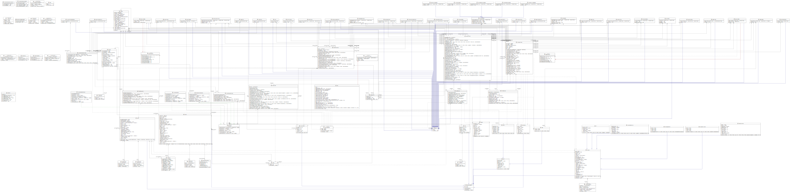

# IFT 2255 - Automne 2023 - Devoir 3 <!-- omit from toc -->

---

## Table des matières

- [Table des matières](#table-des-matières)
- [Information générale](#information-générale)
- [Distribution des tâches](#distribution-des-tâches)
- [Hypothèses](#hypothèses)
- [Tests](#tests)
- [GitHub Action - Java Maven Tests](#github-action---java-maven-tests)
- [JavaDoc](#javadoc)
- [README](#readme)
- [Diagramme de classes UML](#diagramme-de-classes-uml)
- [GitHub Insights](#github-insights)
    - [Pulse:](#pulse)
    - [Contributors](#contributors)

## Information générale

**Nom de l'équipe:** Null Pointer Exception

[Lien vers le repository sur GitHub](https://github.com/etiennecollin/ift2255/)

[Lien vers la release sur GitHub](https://github.com/etiennecollin/ift2255/releases/tag/v0.3.0)

| Nom                     | Matricule | Courriel                             | Temps |
| :---------------------- | :-------: | :----------------------------------- | :---: |
| Etienne Collin          | 20237904  | etienne.collin@umontreal.ca          |  40+  |
| Nicholas Cooper         | 20241729  | nicholas.cooper@umontreal.ca         |  45+  |
| Charlotte Locas         | 20211755  | charlotte.locas@umontreal.ca         |  10+  |
| Aboubakre Walid Diongue | 20198446  | aboubakre.walid.diongue@umontreal.ca |  10+  |

## Distribution des tâches

**Soumissionaire**: Etienne Collin

|                          Tâches | Etienne | Charlotte | Nicholas | Walid |
| ------------------------------: | :------ | :-------- | :------- | :---- |
|                           Tests | 30      | 30        | 30       | 10    |
|                          README | 100     | 0         | 0        | 0     |
|                         Rapport | 100     | 0         | 0        | 0     |
|                         JavaDoc | 100     | 0         | 0        | 0     |
|                   Action GitHub | 100     | 0         | 0        | 0     |
|                     Refactoring | 5       | 0         | 95       | 0     |
| Initialisation de la DB de test | 5       | 0         | 95       | 0     |

> Il faut se fier au temps passé sur le devoir pour interpréter la charge de travail de chaque membre de l'équipe. Certaines tâches étaient plus lourdes que d'autres.

## Hypothèses

Voici quelques hypothèses, des choses qu'UniShop assume pour le bon fonctionnement de sa plateforme:

-   Les utilisateurs peuvent accéder à l'ordinateur sur lequel UniShop est exécuté
-   Les utilisateurs ont accès à internet
-   On suppose que les acheteurs vont marquer leurs commandes comme livrées
-   On suppose que les acheteurs et vendeurs sont honnêtes et intègres
-   On suppose que les vendeurs vendrons des produits qui sont logiques et conformes aux lois.

## Tests

Comme on peut le remarquer, tous les tests JUnit passent:

## GitHub Action - Java Maven Tests

Voici le résultat de l'exécution de l'action GitHub _Java Maven Tests_.

## JavaDoc

La javadoc est disponible à l'adresse suivante:
[https://etiennecollin.com/ift2255](https://etiennecollin.com/ift2255). La source est
disponible sur [GitHub](https://github.com/etiennecollin/ift2255/tree/main/docs).

## README

Le fichier `README.md` est disponible sur la
[page d'accueil du _repository_](https://github.com/etiennecollin/ift2255) et
sur la [release GitHub](https://github.com/etiennecollin/ift2255/releases/tag/v0.3.0)

## Diagramme de classes UML

Voici notre diagramme de classes UML.

> Source disponible sur la [release GitHub](https://github.com/etiennecollin/ift2255/releases/tag/v0.3.0)

## GitHub Insights

### Pulse:

> [Source](https://github.com/etiennecollin/ift2255/pulse/monthly)

### Contributors

> [Source](https://github.com/etiennecollin/ift2255/graphs/contributors)
